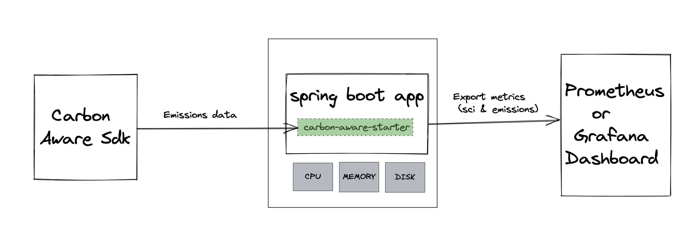

# Spring Boot Carbon-Aware Metrics

> **_Note:  This [project](https://taikai.network/gsf/hackathons/carbonhack22/projects/cl8tglrxx28248701xckvhba0vg/idea) is a part of the [CarbonHack 2022 Hackathon](https://taikai.network/gsf/hackathons/carbonhack22) (10/13/2022 - 11/05/2022).  Check that out for more context and details on how to get involved._**

## The Problem

One of the hardest parts about making carbon-aware computing decisions is knowing how to start seeing real data and measuring the impact of your everyday decisions.  I've always found it hard to know what to measure and how to do it, and sustainability concepts can feel like a rabbit-hole of "if I count this, do I need to figure out how to count that?  Where do I stop?"

This project has three goals:

1. Make it easy to measure and see the carbon impact of my applications, while they're running and while they're doing specific work
2. Make it easy to measure and see that impact across multiple services interacting with each other
3. Make it easy for lots of developers to get that same data and measure improvements towards their sustainability goals

## How This Project Helps

This project aims to leverage industry-standard metrics and tracing implementations like OpenTelemetry to make it easy to understand this data in the same ways we use other business or technical measurements.

It focused on the Java tech stack and specifically the Spring Boot development ecosystem because many enterprises use these today, and if we can make it easier to move the needle just a little for those large software estates we can make a big impact.

JRebel's [Java Technology Report](https://www.jrebel.com/blog/2021-java-technology-report) shows that Spring Boot is currently used on over two thirds of Java projects! [Research on GitHub's public repositories](https://brainhub.eu/library/most-popular-languages-on-github) shows that Java is a consistent top language for all kinds of projects, big or small. And there are lots of java projects tucked away behind enterprises all around the world. If we can make it easy for this community to get carbon awareness for little or no work, that's a lot of potential first steps toward making today's software more sustainable.

## Architecture

At the center of the project is the [carbon-aware-starter](#carbon-aware-starter) which can be added to any spring boot app. The carbon-aware-starter fetches the emissions data from the carbon-aware-sdk. It does the processing on top of this emissions information, the energy it draws and the embodied emissions value and exposes the emissions and the sci value through the actuator endpoints and prometheus metrics. Those can be then monitored on prometheus or grafana dashboard. These can be then furthur used for monitoring & alerting when the sci score crosses a certain limit.



To see a sample example based on this, checkout the [Quickstart](#quickstart) section

## Carbon Aware Starter

The carbon-aware-starter lies at the heart to this project's offering. It provides the following actuator endpoints and prometheus metrics out of the box to monitor the spring boot apps.

| Sl. | Actuator Endpoint          | Prometheus metrics | Description                                                                                         |
|-----|----------------------------|--------------------|-----------------------------------------------------------------------------------------------------|
| 1   | /actuator/carbon/emissions | carbon_emissions   | It provides the marginal carbon intensity from the Carbon-Aware SDK for the application's location. |
| 2   | /actuator/carbon/sci       | carbon_sci         | It provides SCI (Software Carbon Intensity) score of the application                                |

The sci score is calculated by a formulae `SCI = ((E * I) + M)`. For this calculation the following interfaces are provided :
* `EnergyConsumptionProvider (E)`: This interface defines the contract for adding the energy consumed by a software system.
* `MarginalEmissionsProvider (I)`: This interface defines the contract for adding the location-based marginal carbon intensity.
* `EmbodiedEmissionsProvider (M)`: This interface defines the contract for adding the embodied emissions of the hardware needed to operate a software system.

The starter also provides out-of-the-box implementations for each of the above interfaces, but they can also be easily overidden if an implementation is added for these interfaces in the spring boot app which is using this starter. The default implementations are as follows :
* `ResourceUtilizationEnergyConsumptionProvider` : This uses the underlying cpu usage & memory usage along with an energy tax to determine an energy consumption.
* `ConfiguredEmboddiedEmissionsProvider` : This uses a configurable value based on the underlying hardware.
*  `CarbonAwareSdkMarginalEmissionsProvider` : This fetches the marginal emissions from the carbon aware sdk

The starter provides the following properties which needs to be configured for using:

| Sl. | Property                              | Description                                                                                                   |
|-----|---------------------------------------|---------------------------------------------------------------------------------------------------------------|
| 1   | spring.carbon-aware.enabled           | This property needs to be set as true to enable the starter. The default value is false.                      |
| 2   | spring.carbon-aware.endpoint          | This property points to base endpoint of carbon-aware-sdk. A value neeeds to be passed if starter is enabled. |
| 3   | spring.carbon-aware.location          | This property points to location for which the emissions are calculated. Default value is "".                 |
| 4   | spring.carbon-aware.embodiedEmissions | This property points to the emboided emissions for the hardware. Default value is 0.0                         |               |

## Quickstart

In the same example there are two services `hello-service` and `weather-service` where we have added the `carbon-aware-starter`. To start the project do the following steps :

- Ensure that java-17 is installed in your machine
- Create a `.env` file having the following properties :
```
  WATTTIME_CLIENT_USERNAME=<watttime_username>
  WATTTIME_CLIENT_PASSWORD=<watttime_password>
  EMISSIONS_LOCATION=<emissions_location>
  ```
- Build the application docker containers with `./playground.sh`
- Start the docker containers (along with the third-party collectors) with `docker-compose up -d --build`
- To visualise on grafana dashboards, use prometheus as a datasource and use `carbon_emissions` and `carbon_sci` as metrics in panels.
