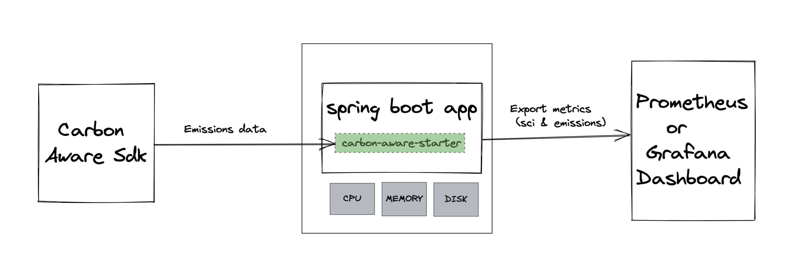

= Spring Boot Carbon Metrics
Matthew Campbell, Debojyoti Dey
:toc: left

== Introduction

The Spring Boot Carbon Metrics project aims to provide a batteries-included auto-configured tool to instrument Spring Boot applications with carbon-aware features.  It leans heavily on the <<sci, Green Software Foundation's SCI specification>> along with other projects to provide the necessary components to compute SCI.

Rather than implementing low-level measurements itself, this project provides a modular framework to wire in existing measurement tools to gather energy use, carbon intensity, or embodied emissions and automatically compute and expose them in a standard way.

=== Why this project exists

One of the hardest parts about making carbon-aware computing decisions is knowing how to start seeing real data and measuring the impact of your everyday decisions. It's hard to know what to measure and how to do it, and sustainability concepts can feel like a rabbit-hole of "if I count this, do I need to figure out how to count that? Where do I stop?"

==== Goals
This project has three goals:

1. Make it easy to measure and see the carbon impact of your Spring Boot applications, while they're running and while they're doing specific work
1. Make it easy to measure and see that impact across multiple services interacting with each other
1. Make it easy for lots of developers to get that same data and measure improvements towards their sustainability goals

This project aims to leverage industry-standard metrics and tracing implementations to make it easy to understand this data in the same ways we use other business or technical measurements.

==== Why Java?  Why Spring Boot?

It is focused on the Java tech stack and specifically the Spring Boot development ecosystem because many enterprises use these today, and if we can make it easier to move the needle just a little for those large software estates we can make a big impact.

JRebel's link:https://www.jrebel.com/blog/2021-java-technology-report[Java Technology Report] shows that Spring Boot is used on over two thirds of Java projects! link:https://brainhub.eu/library/most-popular-languages-on-github[Research on GitHub's public repositories] shows that Java is a consistent top language for all kinds of projects, big or small. And there are lots of java projects tucked away behind enterprises all around the world. If we can make it easy for this community to get carbon awareness for little or no work, that's a lot of potential first steps toward making today's software more sustainable.

=== What is Software Carbon Intensity [[sci]]

The link:https://greensoftware.foundation[Green Software Foundation's] link:https://github.com/Green-Software-Foundation/sci[Software Carbon Intensity specification] is a effort that provides guidance on how to compute an application's carbon impact in a standard way that allows you to compare multiple services (or multiple implementations of the same service) and make decisions that reduce that impact.

The specification itself is very readable, and explains the purpose of this approach best:

> Reducing an SCI score is only possible through the elimination of emissions. That can be achieved by modifying a software system to use less physical hardware, less energy, or consume lower-carbon energy sources.

The three key components used by SCI listed above deserve special attention as developers of Spring Boot applications:

==== Using Less Physical Hardware

The concept of _embodied emissions_ means that all physical hardware - the compute hardware serving your application, the network infrastructure delivering it to users, the disks providing storage, _everything_ - needed to be built in order to make your application possible.  If your app didn't need to be hosted and all other apps didn't need to be hosted, the hardware wouldn't need built in the first place and the resulting carbon impact of building it wouldn't exist.

This means that by building and running our software, we have to own some portion of the carbon impact from all that hardware being built.  It's impossible to have _zero_ emobodied emissions in reality, but the first way to reduce our application's carbon intensity score is to make our software more efficient with the resources it needs.  By building our application to use less CPU, memory, network, and storage, we can run more software on the same hardware and use existing hardware for longer before upgrading.

==== Using Less Energy

Running any kind of software requires energy (measured in watts) running through the hardware to do any kind of work.  Energy measurements come in a variety of link:https://firefox-source-docs.mozilla.org/performance/power_profiling_overview.html#power-and-power-related-measurements[shapes, sources, and accuracies].

==== Using Cleaner Energy

Whenever your application runs and uses energy to do its job, that energy ultimately comes from a source that produces some greenhouse gases as a byproduct.  Some methods of producing energy result in less greenhouse gas, and we can reduce our application's impact by doing our work in a location that has access to these cleaner energy options.  We can do this in two ways:

1. Some data centers and cloud regions have access to clean energy sources, so we can chose to deploy our application in a location that generally has cleaner energy
1. The mix of energy sources providing electricty on a power grid can change over time (throughout the day as solar availability changes, or over longer periods of time as weather and seasons shift).  We can chose to move or delay our workloads so that they run when energy is cleaner.

== Getting Started

You can get started with Spring Boot Carbon Metrics in an existing Spring Boot project by adding the starter as a dependency to your project:

```xml
<dependency>
  <groupId>com.snowfort</groupId>
  <artifactId>carbon-aware-starter</artifactId>
  <version>0.0.1-SNAPSHOT</version>
</dependency>
```

⚠️ _️Note: At this early stage of the project, we only publish build artifacts to GitHub Packages.  You'll need to add GitHub packages as a server and repository along with a personal access token to your Maven `~/.m2/settings.xml` as described in link:https://docs.github.com/en/packages/working-with-a-github-packages-registry/working-with-the-apache-maven-registry#authenticating-with-a-personal-access-token[the GitHub documentation]._

settings.xml:
```xml
<settings xmlns="http://maven.apache.org/SETTINGS/1.0.0"
  xmlns:xsi="http://www.w3.org/2001/XMLSchema-instance"
  xsi:schemaLocation="http://maven.apache.org/SETTINGS/1.0.0
                      http://maven.apache.org/xsd/settings-1.0.0.xsd">

  <servers>
    <server>
      <id>github</id>
      <username>USER</username>
      <password>TOKEN</password>
    </server>
  </servers>

</settings>
```

pom.xml:
```xml
  ...
  <repositories>
    <repository>
      <id>central</id>
      <url>https://repo1.maven.org/maven2</url>
    </repository>
    <repository>
      <id>github</id>
      <url>https://maven.pkg.github.com/mtthwcmpbll/spring-boot-carbon-metrics</url>
      <snapshots>
        <enabled>true</enabled>
      </snapshots>
    </repository>
  </repositories>
  ...
```

The Spring Boot Carbon Metrics project integrates with Green Software Foundation's link:https://github.com/Green-Software-Foundation/carbon-aware-sdk[Carbon-Aware SDK].  You can start up a local instance that communicates with the WattTime API as link:https://github.com/Green-Software-Foundation/carbon-aware-sdk/pkgs/container/carbon-aware-sdk[a Docker container] with the following command:

```bash
docker run -t -i \
  -e 'DataSources__EmissionsDataSource=WattTime' \
  -e 'DataSources__ForecastDataSource=WattTime' \
  -e 'DataSources__Configurations__WattTime__Type=WattTime' \
  -e 'DataSources__Configurations__WattTime__username=USERNAME' \
  -e 'DataSources__Configurations__WattTime__password=PASSWORD' \
  -p 80:80 \
  --name carbon-aware-sdk ghcr.io/green-software-foundation/carbon-aware-sdk:sha-fb98ef8
```

Finally, configure a handful of properties for in your `application.yml` to point the application to the Carbon-Aware SDK:

```yaml
spring:
  carbon-aware:
    enabled: true
    endpoint: http://localhost:80
    location: westus2
```

You can find a list of supported locations for your application in the link:https://github.com/Green-Software-Foundation/carbon-aware-sdk/blob/e9885d7190f2d7af05a32ef172d92328b0b6a8d8/src/data/location-sources/azure-regions.json[Carbon-Aware SDK Azure Region names].

If you start up your application now, you'll see a couple of new metrics published to your `/actuator/metrics` endpoints, including `carbon_emissions` and `carbon_sci`:

```bash
➜ curl "http://localhost:8080/actuator/metrics/carbon.emissions" | jq

{
  "name": "carbon.emissions",
  "description": null,
  "baseUnit": null,
  "measurements": [
    {
      "statistic": "VALUE",
      "value": 516.18811706
    }
  ],
  "availableTags": []
}
```

== Architecture

At the center of the project is the link:#carbon-aware-starter[carbon aware starter] which can be added to any spring boot app. The carbon-aware-starter fetches the emissions data from the carbon-aware-sdk. It does the processing on top of this emissions information, the energy it draws and the embodied emissions value and exposes the emissions and the <<sci, SCI>> value through the actuator endpoints and prometheus metrics. Those can be then monitored on prometheus or grafana dashboard. These can be then further used for monitoring & alerting when the sci score crosses a certain limit.



=== Providers

The internal architecture provided by the carbon aware starter is modeled closely off of three primary components of the software carbon intensity score - emboddied emissions, energy consumption, and marginal emissions.  Each component is computed by a dedicated provider bean, allowing the starter to swap out better providers for specific environments or for developers to provide their own implementations.

==== Embodied Emissions Providers

- `ConfiguredEmbodiedEmissionsProvider` _(default)_ - This provider uses a static configured value as the embodied emissions for this service and the hardware it's using.  If left unconfigured, the default embodied emissions value is 0.
+
configuration:
+
```
spring:
  carbon-aware:
    embodiedEmissions: 0.0
```

==== Energy Consumption Providers

- `ResourceUtilizationEnergyConsumptionProvider` _(default)_ - This provider uses a heuristic approach based on the amount of CPUs used by the application and the percentage of those CPUs used.  This isn't the best stand-in for energy consumption, as it misses many other hardware that contribute to energy consumption and won't provide an concrete value in kilowatt-hours (kWh) as expected by the SCI computation.  It does scale roughly with the biggest contributor to energy usage though, and requires no special instrumentation for particular hardware so it's provided as a zero-configuration fallback.

- `PowerUtilizationEnergyConsumptionProvider` - This provider uses the link:https://github.com/oshi/oshi[Oshi library] to pull live power consumption data from the underlying hardware.  This provider is much more accurate than the default heuristic approach, and is automatically configured whenever your project link:https://central.sonatype.com/artifact/com.github.oshi/oshi-core-java11/6.4.4[includes Oshi on the classpath].

==== Marginal Emissions Providers

The starter currently providers the following providers:

- `CarbonAwareSdkMarginalEmissionsProvider` _(default)_ - This provider connects to the Green Software Foundation's Carbon-Aware SDK and provides the applications configured location to the SDK via an HTTP call to it's API.
+
configuration:
+
```
spring:
  carbon-aware:
    endpoint: http://localhost:80
    location: westus2
```