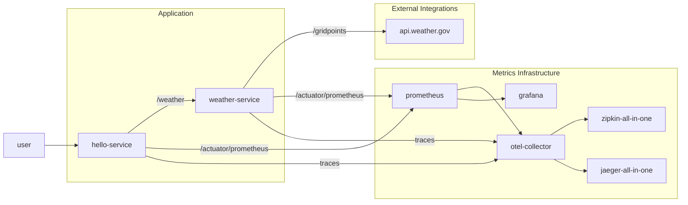

# Greetings & Weather Forecast

This example shows a small example with two Spring Boot microservices:

- **weather-service** provides a single API endpoint `GET /weather` that calls the US National Weather API to get a weather forecast.  This lets us see what kinds of metrics we can or cannot provide at the boundary of a service calling an external dependency that we can't change or instrument.
- **hello-service** provides a single API endpoint `GET /greeting/{name}` that will call the weather service to get a forecast and provide a friendly response with weather information

## Structure

The provided Docker Compose file will start all of these services up, along with a couple of industry tools to go along with them:

1. The open-source OpenTelemetry Collector, with the applications configured to send distributed trace logs
1. Jaeger & Zipkin to visualize and process OpenTelemetry traces
1. Prometheus & Grafana to process and visualize metrics information from our services metrics endpoints.

## Useful links:
- [Hit the fake weather API](http://0.0.0.0:8085/gridpoints/TOP/31,80/forecast) or the fake [Weather Radar API](http://0.0.0.0:8085/radar/stations)
- Look at traces in [Jaeger](http://0.0.0.0:16686) or [Zipkin](http://0.0.0.0:9411)
- Look at [Prometheus](http://0.0.0.0:9090) or [Grafana](http://0.0.0.0:3000)
